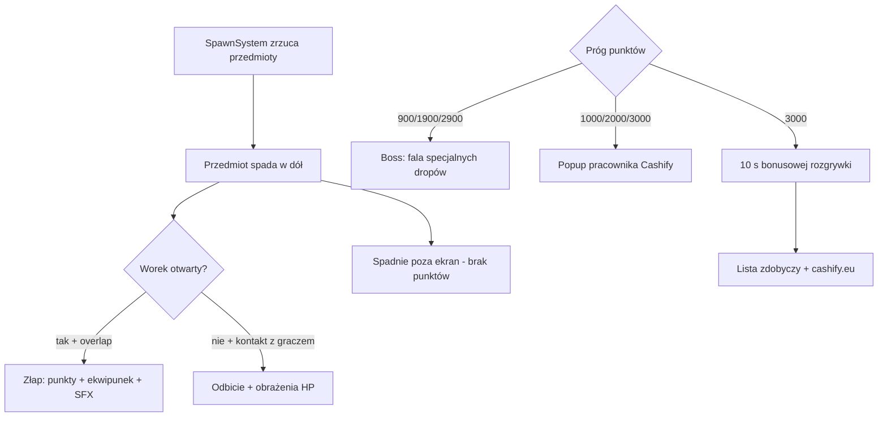
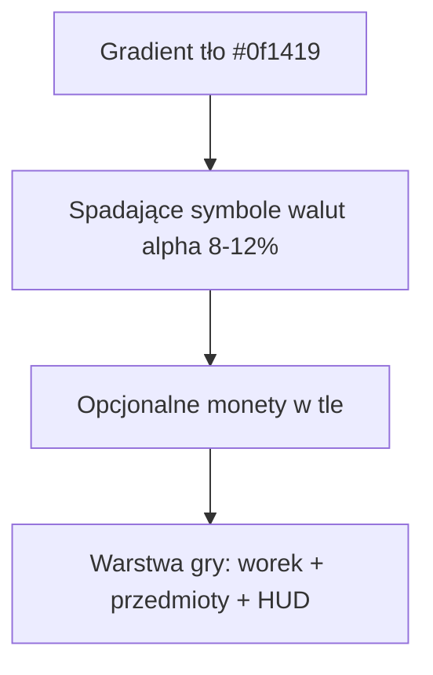
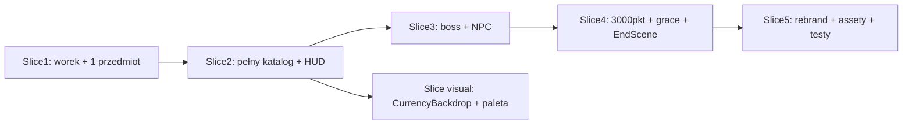

# Plan: Firewall → Cashify Game

## Stan obecny

Gra to **Vite + TypeScript + Phaser 4** z rdzeniem w [`src/scenes/GameScene.ts`](src/scenes/GameScene.ts):

- gracz = statek + **tarcza** ([`ShieldSystem.ts`](src/systems/ShieldSystem.ts), Spacja / przycisk „TARCZA”)
- wrogowie malware ([`Enemy.ts`](src/entities/Enemy.ts)) + 1 boss przy 900 pkt ([`Boss.ts`](src/entities/Boss.ts))
- wygrana: boss pokonany + 100 pkt ([`RunController.ts`](src/systems/RunController.ts))
- tekstury proceduralne ([`SpriteTextures.ts`](src/art/SpriteTextures.ts)), brak assetów w `public/` (poza favicon)
- ekran końcowy: ranking + YouTube ([`EndScene.ts`](src/scenes/EndScene.ts))

## Docelowa mechanika



| Element   | Zachowanie                                                                                                                                      |
| --------- | ----------------------------------------------------------------------------------------------------------------------------------------------- |
| Ruch      | Joystick (mobile) / strzałki+WASD — jak teraz, dolna strefa ekranu                                                                              |
| Worek     | **Przytrzymanie Spacji** lub przycisk „WOREK” (mobile) — otwiera złap-kolizję nad graczem                                                       |
| Bez worka | Przedmiot **odbija się** od gracza; kontakt **zabiera HP** (3 życia, respawn −15 pkt — bez zmian)                                               |
| Boss ×3   | Przy **900 / 1900 / 2900** pkt: pauza zwykłych spawnów, boss zrzuca **5–10 specjalnych sztabek**; każde złapanie otwartym workiem = −1 HP bossa |
| NPC ×3    | Przy **1000 / 2000 / 3000** pkt: panel z boku + chmurka (gra w tle, 4 s)                                                                        |
| Wygrana   | **3000 pkt** → popup Jakuba → **10 s** dalszej gry → ekran końcowy                                                                              |
| Koniec    | Lista złapanych przedmiotów (nazwa × ilość) + przycisk **„Idź do Cashify”** → `https://cashify.eu`                                              |

## Progi punktów (kolejność w sesji)

1. **900** — Boss 1 (złota sztabka bossa)
2. **1000** — **Jacek**: _„Dawaj, dawaj, nie poddawaj się! Ja w twoim wieku lepiej grałem.”_
3. **1900** — Boss 2
4. **2000** — **Weronika**: _„No złotko, jeszcze trochę a będziesz bogaty.”_
5. **2900** — Boss 3
6. **3000** — **Jakub**: _„Udało ci się osiągnąć cel! Teraz możesz się skeszować w Cashify.”_ + start timera 10 s
7. **+10 s** — koniec gry (win)

Progi NPC i bossów śledzić flagami `triggered` (jednorazowo), żeby nie powtarzały się przy respawnie/wstecz.

## Katalog przedmiotów

Nowy plik [`src/data/items.ts`](src/data/items.ts) — typy, punkty, tekstura, etykieta PL:

**Krypto (logo PNG):** BTC, ETH, BNB, XRP, SOL, DOGE, USDT, TRON, XMR, USDC

**Waluty fiat:** PLN, USD, EUR, Peso (MXN), Korona (CZK)

**Metale:** sztabka złota, sztabka srebra, moneta złota, moneta srebra

**Boss drop:** `boss_bar` — specjalna złota sztabka (tylko podczas fazy bossa)

Przykładowe punkty (tuning w [`config.ts`](src/config.ts)):

| Kategoria             | Punkty                                                     |
| --------------------- | ---------------------------------------------------------- |
| Krypto top (BTC, ETH) | 25–30                                                      |
| Krypto alt            | 15–20                                                      |
| Fiat                  | 10–15                                                      |
| Monety                | 12                                                         |
| Sztabki               | 20–35                                                      |
| Boss bar              | 0 pkt (liczy się do HP bossa) + bonus 100 pkt po pokonaniu |

## Assety (`public/`)

Struktura do przygotowania (Ty wrzucasz NPC + ewentualnie logo; resztę możemy dodać z darmowych icon packów):

```
public/assets/
  npc/jacek.png, weronika.png, jakub.png
  crypto/btc.png, eth.png, bnb.png, xrp.png, sol.png, ...
  fiat/pln.png, usd.png, eur.png, peso.png, korona.png
  metals/gold_bar.png, silver_bar.png, gold_coin.png, silver_coin.png
  boss/boss_bar.png
  player/bag.png          (opcjonalnie — fallback: proceduralny worek)
  audio/cashify.mp3       (opcjonalnie — fallback: brak muzyki)
```

[`BootScene.ts`](src/scenes/BootScene.ts): `this.load.image(...)` dla wszystkich kluczy z `items.ts` + NPC. Proceduralne tekstury zostają tylko dla worka/particles, jeśli brak PNG.

## Zmiany w kodzie (mapa plików)

### Nowe moduły

| Plik                                                               | Rola                                                                                     |
| ------------------------------------------------------------------ | ---------------------------------------------------------------------------------------- |
| [`src/systems/BagSystem.ts`](src/systems/BagSystem.ts)             | Zastępuje `ShieldSystem`: stan otwarty/zamknięty, wizualizacja worka, kolizja łapania    |
| [`src/entities/FallingItem.ts`](src/entities/FallingItem.ts)       | Zastępuje `Enemy`: prosty spadek, odbicie przy zamkniętym worku, `catch()` przy otwartym |
| [`src/systems/InventorySystem.ts`](src/systems/InventorySystem.ts) | Czysta logika: `Map<ItemType, number>`, serializacja do EndScene                         |
| [`src/ui/EmployeePopup.ts`](src/ui/EmployeePopup.ts)               | Avatar + chmurka tekstu, slide-in z prawej, auto-dismiss 4 s                             |
| [`src/data/items.ts`](src/data/items.ts)                           | Katalog przedmiotów + punkty + ścieżki assetów                                           |

### Refaktoryzacja istniejących

| Plik                                                                                             | Zmiana                                                                                                                                                 |
| ------------------------------------------------------------------------------------------------ | ------------------------------------------------------------------------------------------------------------------------------------------------------ |
| [`src/config.ts`](src/config.ts)                                                                 | `WIN_SCORE=3000`, `GRACE_MS=10000`, `BOSS.spawnAtScores=[900,1900,2900]`, `NPC_MILESTONES`, `CASHIFY_URL`, usunięcie stałych tarczy/strzału/power-upów |
| [`src/entities/Player.ts`](src/entities/Player.ts)                                               | Wizual worka zamiast statku-tarczy; kolizja ciała bez zmian (HP)                                                                                       |
| [`src/entities/Boss.ts`](src/entities/Boss.ts)                                                   | Uproszczenie: stoi u góry, co ~800 ms zrzuca `boss_bar`; po X złapaniach — bonus + powrót spawnów                                                      |
| [`src/scenes/GameScene.ts`](src/scenes/GameScene.ts)                                             | Główna przebudowa: `BagSystem`, `FallingItem`, 3 bossy, NPC, grace timer, inventory                                                                    |
| [`src/systems/SpawnSystem.ts`](src/systems/SpawnSystem.ts) + [`waves.json`](src/data/waves.json) | Spawnowanie typów przedmiotów zamiast wrogów malware                                                                                                   |
| [`src/systems/RunController.ts`](src/systems/RunController.ts)                                   | Nowy warunek win: score ≥ 3000 + grace elapsed; usunięcie logiki „po bossie +100”                                                                      |
| [`src/ui/HUD.ts`](src/ui/HUD.ts)                                                                 | Usunąć pasek energii tarczy/buffy; progres do 3000; opcjonalnie licznik złapanych                                                                      |
| [`src/scenes/MenuScene.ts`](src/scenes/MenuScene.ts)                                             | Rebranding: **CASHIFY**, tagline kantoru, instrukcja „Spacja = worek”; tło `CurrencyBackdrop`                                                          |
| [`src/ui/CurrencyBackdrop.ts`](src/ui/CurrencyBackdrop.ts)                                       | **Nowe** — tło planszy: symbole walut zamiast siatki neon ([`RetroGridBackground.ts`](src/ui/RetroGridBackground.ts) do usunięcia)                    |
| [`src/scenes/EndScene.ts`](src/scenes/EndScene.ts)                                               | Tytuł wygranej, **lista zdobyczy** z `InventorySystem`, link `cashify.eu` zamiast YouTube; ranking opcjonalnie zostaje                                 |
| [`src/systems/ScoreSystem.ts`](src/systems/ScoreSystem.ts)                                       | `addCatch(itemType)` zamiast `addKill(enemyType)`                                                                                                      |
| [`src/art/SpriteTextures.ts`](src/art/SpriteTextures.ts)                                         | Proceduralny worek + particle; reszta z PNG                                                                                                            |

### Usunięcie / wygaszenie

- [`ShieldSystem.ts`](src/systems/ShieldSystem.ts) → zastąpiony przez `BagSystem`
- [`PowerUpSystem.ts`](src/systems/PowerUpSystem.ts), strzały, buffy — **usunąć** z GameScene (poza scope nowej gry)
- [`Enemy.ts`](src/entities/Enemy.ts) — zastąpiony przez `FallingItem.ts`

### Testy (Vitest)

Zaktualizować istniejące testy i dodać:

- `RunController`: win po 3000 + grace, bez starej logiki boss+100
- `InventorySystem`: zliczanie typów
- `BagSystem` (logika czysta): overlap open = catch, closed = bounce flag

## Wizual / UX — plansza w stylu [Cashify](https://cashify.eu/)

**Zakres:** wyłącznie ten projekt (`cashify_game`, Phaser 4, 480×800). Dotyczy każdej sceny z tłem: **Menu → Game → End** (oraz ewentualnie Boot, jeśli pokaże loader). Nie osobna strona www — to warstwa wizualna **wewnątrz gry**.

Kantor na stronie to **ciemne, eleganckie tło + złoto (metale szlachetne) + profesjonalny fintech**, nie cyber-neonowa siatka z Firewall. Plansza gry ma to odzwierciedlać.

### Paleta (zastąpić `COLORS` w [`config.ts`](src/config.ts))

| Rola | Hex | Użycie |
|------|-----|--------|
| `bg` | `#0f1419` | Głębokie tło planszy (ciemny grafit, jak strona) |
| `gold` | `#C9A227` | Akcent główny — złoto, CTA, progres, boss |
| `goldLight` | `#E8C547` | Poświata, highlight HUD |
| `cash` | `#3DB87A` | Sukces, HP, przycisk START |
| `fiat` | `#6B8CAE` | Waluty fiat, drugorzędny akcent |
| `crypto` | `#F0B429` | Krypto (ciepły „digital gold”) |
| `text` | `#E8EAED` | Tekst UI |
| `panel` | `#1a222d` | Panele HUD / popup NPC |

**Wycofać** dominujące cyan `#00f0ff` i magenta `#ff00aa` z tła i dużych elementów — zostawić co najwyżej jako subtelny akcent ostrzeżenia (np. niski HP), żeby nie konkurowały z brandingiem kantoru.

Po zmianie palety przejść po: [`HUD.ts`](src/ui/HUD.ts), [`MenuScene.ts`](src/scenes/MenuScene.ts), [`EndScene.ts`](src/scenes/EndScene.ts), [`EmployeePopup.ts`](src/ui/EmployeePopup.ts), particle tint, przycisk WOREK (złoto zamiast cyan).

### Tło planszy — zamiast kratki

**Usunąć / zastąpić:** [`RetroGridBackground.ts`](src/ui/RetroGridBackground.ts) (scrollująca siatka neon + scanline).

**Nowy moduł:** `src/ui/CurrencyBackdrop.ts` (lub `CashifyBoardBackground.ts`) — ten sam kontrakt co dziś: `constructor(scene)` + `update(dtSec)`, depth `-2` / `-1`.

**Koncepcja wizualna (kojarzy się z walutami, nie z „Tron grid”):**

1. **Warstwa bazowa** — jednolity gradient pionowy: `bg` → nieco jaśniejszy `#151c24` u dołu (głębia, jak sala kantoru).
2. **Warstwa symboli** — 18–28 półprzezroczystych glyphów walutowych (`$`, `€`, `£`, `¥`, `zł`, `₿`), losowe pozycje startowe, **wolny spadek** (60–90 px/s) + lekki ruch sinusoidalny w poziomie; alpha 0.06–0.12, kolor `gold` / `fiat` naprzemiennie.
3. **Warstwa monet (opcjonalna)** — 6–10 proceduralnych kółek „moneta” (obwódka złota, środek ciemny) w tle, jeszcze wolniej niż symbole.
4. **Bez scanline** z Firewall — opcjonalnie bardzo subtelny vignette na krawędziach zamiast retro CRT.



**Implementacja techniczna:** `Phaser.GameObjects.Graphics` + tablica `{ x, y, glyph, speed, phase }` odświeżana w `update` (bez assetów PNG na start). Ewentualnie później podmiana na lekką teksturę tile z watermarkiem banknotu — nie w MVP.

**Gdzie podpiąć w repo:**

| Scena | Plik | Zmiana |
|-------|------|--------|
| Menu | [`MenuScene.ts`](src/scenes/MenuScene.ts) | `new CurrencyBackdrop(this)` zamiast `RetroGridBackground` |
| Gra | [`GameScene.ts`](src/scenes/GameScene.ts) | j.w. w `create()` + `update()` |
| Koniec | [`EndScene.ts`](src/scenes/EndScene.ts) | j.w. |

Wspólna paleta: [`config.ts`](src/config.ts) → `COLORS` / `COLOR_HEX` (jedno źródło dla HUD, przycisku WOREK, particle, popupów NPC).

### Reszta UX (bez zmian)

- Przycisk mobile: **„WOREK”** (pozycja z [`TOUCH`](src/config.ts)), styl przycisku: obrys + wypełnienie `gold`.
- Boss: pasek HP w `gold`, flash przy wejściu.
- NPC: panel z prawej, chmurka z `panel` + obrys `gold`, avatary z `public/assets/npc/`.
- Menu: tytuł **CASHIFY**, tagline w stylu strony np. _„Jakieś krypto? Gotóweczka?”_ (skrócona wersja hero ze strony).

## Ekran końcowy (mockup treści)

```
CASHIFY — CEL OSIĄGNIĘTY!
Wynik: 3240 · Czas: 2:15

Twoje zdobycze:
  Bitcoin × 12
  Ethereum × 8
  Sztabka złota × 5
  PLN × 14
  ...

[↻ Zagraj jeszcze raz]
[→ Idź do Cashify — cashify.eu]
```

## Kolejność implementacji (vertical slices)



1. **Slice 1** — `BagSystem` + `FallingItem` + ruch gracza; 1 typ przedmiotu, punkty, odbicie/HP
2. **Slice 2** — pełny katalog itemów, `InventorySystem`, spawn z `waves.json`, rebranding HUD (cel 3000)
3. **Slice 3** — 3 fazy bossa (catch special drops), `EmployeePopup` ×3
4. **Slice 4** — grace 10 s po 3000, nowy `EndScene` z listą + link
5. **Slice visual** — `CurrencyBackdrop` + nowa paleta `COLORS` (można zrobić równolegle ze slice 2/5)
6. **Slice 5** — assety PNG, menu, dźwięki, testy, cleanup starych plików firewall; usunąć `RetroGridBackground.ts`

## Ryzyka i decyzje

- **Assety krypto:** jeśli nie dostarczysz PNG od razu, gra startuje z placeholderami (kolorowe kółka + skrót „BTC”) — łatwa podmiana w `BootScene`
- **Ranking online:** zostaje bez zmian ([`scoreApi.ts`](src/systems/scoreApi.ts)); worker/API nadal działa — ewentualna zmiana nazwy endpointu poza scope tej iteracji
- **Muzyka:** `firewall.mp3` → opcjonalnie `cashify.mp3`; brak pliku nie blokuje gry
- **Pauza przy NPC:** gra **nie zatrzymuje się** (tylko krótki overlay), boss faza **wstrzymuje** zwykłe spawny

## Pliki kluczowe do pierwszej edycji

Największy diff: [`GameScene.ts`](src/scenes/GameScene.ts) (~400 linii do przepisania). Reszta to wymiana importów i nowe małe moduły.

Przykład docelowej kolizji (pseudokod):

```typescript
// BagSystem.update(holding, items, onCatch)
if (holding && itemOverlapsBag(item)) {
  onCatch(item); // ScoreSystem.addCatch + InventorySystem.add
} else if (itemOverlapsPlayer(item) && !holding) {
  item.bounceOff(player); // odwróć velocity.y + lekki vx
  player.takeDamage(CONTACT_DAMAGE);
}
```
